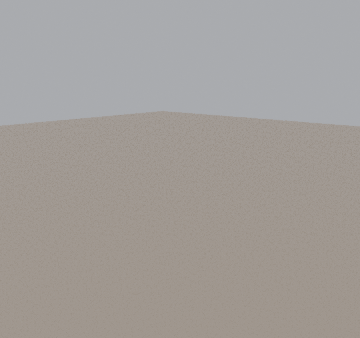

# Blood Reaper – Mythic goal effect (HEX)



**Deliverable:** `output/BloodReaper_MythicGoal.fbx`
- Size: about 8 MB, textures embedded.
- Animation: one baked clip at 60 fps, 4.0 s / 241 frames.

`output/BloodReaper_review.png` is a contact sheet of the attack from three angles.

## Placement and scale
- **Origin:** the spot on the floor where the Reaper rises. Z up in Blender (Y up in the FBX). The Reaper faces **-Y**.
- **Size:** real world, centimetres in the FBX. The Reaper stands about **4.2 m (≈15 studs)**, roughly 3× a Roblox avatar.
  - Taller with the scythe raised: the blade reaches about 6.1 m at the top of the swing.
  - Footprint: about 6.5 m across, because the sweep reaches about 3.3 m to each side.
  - Leave room around the spawn point.
- **Roblox import:** import as a rigged model (3D Importer). If your importer asks for the file's units, choose centimetres; if the Reaper comes in at the wrong size, scale it uniformly to 15 studs tall.
- **Start and end below the floor:** the Reaper is completely below the floor on the first and last frames (top at -0.4 m and -0.8 m), so the floor hides it. In a scene without a floor, hide the model on those frames. The clip is one-shot and does not loop.

## Timeline (60 fps)
| t (s) | beat |
|---|---|
| 0.00 – 1.40 | rises out of the ground as if summoned, hunched, wings folded behind, scythe held low in the left hand |
| 1.40 – 1.85 | straightens and slowly raises its head: the crimson eyes burn under the hood. Wings unfurl |
| 1.85 – 2.02 | the right hand comes across and takes the shaft: **two-handed grip** from here on |
| 2.02 – 2.25 | **wind-up:** the torso twists left, and the scythe goes high over the left shoulder with the blade trailing |
| 2.25 – 2.70 | **the sweep:** one huge arc. The torso unwinds and the blade cuts left → front → right at chest height, then follows through out to the right |
| 2.70 – 2.92 | **raise:** the scythe swings up overhead, the blade going back over the shoulders |
| 2.92 – 3.12 | **slam:** the blade comes over the top and is driven down, and the tip bites ~25 cm into the ground in front. The body dips on impact |
| 3.12 – 3.36 | hold: leaning on the planted scythe, a small rebound |
| 3.36 – 4.00 | sinks slowly back beneath the surface, scythe and all |

## How it was animated
- **Rig and skinning:**
  - The skeleton is recovered from the original biped (86 bones plus wing bones) in the supplied Alembic.
  - Skin weights are solved from the Alembic's own vertex animation (non-negative least squares per vertex, capped at 4 influences), so the body deforms the way the source did.
- **Robe and trinkets:** springs that lag and swing with the pelvis.
  - Robe skirt: 8×3 cloth bones.
  - Hip pouch, charms and chain: one pendulum bone each.
- **Arms:** solved every frame with anatomical two-bone IK.
  - Elbow swivel is searched per frame.
  - Wrist twist is shared with the forearm.
  - Hand roll around the shaft is chosen globally over the whole attack (Viterbi), so the grips never flip.
- **Scythe:** has its own `Scythe` bone. Its key poses were searched and then optimised for:
  - hand reach, so both hands are always on the shaft;
  - relaxed wrists;
  - the whole scythe (shaft, pommel and blade) staying clear of the body, robe and wings, with the arms clear of the torso;
  - the blade tip landing in the ground on the slam.

  Keys are blended with smooth Catmull-Rom curves (quaternions for rotation), with the torso twist, lean and head turn leading the swing.
- **Review:**
  - Every frame was checked for scythe/body, scythe/wing, arm/torso and wing/body overlap, grip distance, blade height and vertex speed (`checks_reaper.py`).
  - Contact sheets were rendered from front, side, three-quarter, back, top and hand close-up views (`preview_reaper.py`).

## Rig / meshes (Roblox)
- **Bones:** 115
  - `Root`
  - Biped: `Pelvis`, `Spine1–3`, `Ribcage`, `Neck`, `Head`, `Clavicle_*`, `UpperArm_*`, `Forearm_*`, `Hand_*`, `Finger*_*`
  - `Wing*_*`
  - `Scythe`
  - `Robe{0–7}_{0–2}`
  - `Trinket_*`
- **Influences:** at most 4 per vertex.
- **Triangle count:** about 15k. The largest mesh, the body, is about 9k.
- **Materials:**
  - `BloodReaper_Body`: albedo with the alpha mask packed into the PNG's alpha channel, normal map, emission (glowing runes). In Roblox set **AlphaMode = Transparency** (or Overlay) on its SurfaceAppearance so the ragged robe edges cut out.
  - `BloodReaper_Scythe`: albedo and normal.
  - `BloodReaper_Eyes` (`BloodReaper_EyeGlow`): two eye meshes on the head bone. Set their **Material to Neon** and Color to crimson (255, 18, 8) for the glow, and add a PointLight to the Head if you want them to light the hood.
- **Body normal map:** generated from the albedo. The normal map image sent in chat wasn't received as a file. Upload it to swap it in.

## Rebuild
Requires Python and `pip install bpy`. Work files go to `work/`.
```
python extract_cache.py                    # Alembic -> work/cache.npz
python fit_weights.py                      # skin weights from the vertex cache
python export_topo.py                      # triangle classes for the collision proxy
python intent_search.py                    # sweep/slam key poses  (paste into choreo_reaper.SCYTHE_KEYS)
python optimize_keys.py                    # refine keys -> work/scythe_keys.json
python dp_grips.py                         # torso twist + hand rolls over the whole attack
NO_FBX=1 python build_reaper.py work/anim anim
python checks_reaper.py work/anim/BloodReaper.blend 2
python preview_reaper.py work/anim/BloodReaper.blend sheet.png 2.0,2.4,2.9,3.1 front,side,three
python export_fbx.py work/anim/BloodReaper.blend output/BloodReaper_MythicGoal.fbx
```
