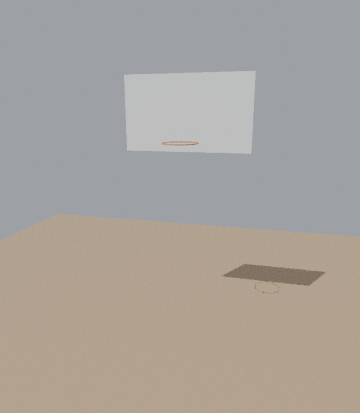

# Dread Serpent – Legendary goal effect



**Deliverable:** `output/DreadSerpent_LegendaryGoal.fbx` (12.7 MB, textures embedded, one baked 60 fps clip, 4.0 s / 241 frames).
`output/textures/` has the same maps as loose PNGs for engines that ignore embedded textures; `output/DreadSerpent_LegendaryGoal.blend` is the editable scene.

## Placement
- **Origin = centre of the rim.** Z up in Blender (Y up in the FBX), the court/camera is at **-Y**, the backboard is behind at **+Y**.
- Real-world scale (metres in Blender, cm in the FBX): sized for a regulation rim (Ø 45.7 cm, floor 3.05 m below the rim, board face 38 cm behind the rim centre). The serpent is about 2.7 m long. The head and chest are as wide as the rim allows, so they fit through it on the strike.
- For a bigger hoop, scale the whole rig uniformly by `your rim diameter / 0.457`.
- The serpent starts and ends **below the floor**, so the floor hides it at both ends. In a scene without a floor, hide the model on the first and last frame.

## Timeline (60 fps)
| t (s) | beat |
|---|---|
| 0.00 – 0.55 | erupts out of the floor beside the hoop (right side). The column snakes in S-waves, jaw opening |
| 0.55 – 1.50 | shoots up and wraps counter-clockwise around the rim. The coil runs wide around the head and chest, then cinches tight onto the rim behind them |
| 1.50 – 2.08 | rears up out of the coil like a cobra, the head rising above the hoop |
| 2.08 – 2.88 | **stare:** the head levels out and glares at the court, sways slightly and parts the jaw. Claws open to the sides, and a slow ripple runs down the neck and tail |
| 2.88 – 3.16 | recoil: draws back and up, jaw wide open (roar) |
| 3.16 – 3.30 | **strike:** the head whips over and down onto the rim axis |
| 3.30 – 3.95 | plunges straight down through the centre of the rim with a corkscrew half-roll, curves out toward the court and dives into the floor. The whole body follows through the rim |

## How it moves
The spine is posed **follow-the-leader**. Every frame a centre-line path is built: erupting column → coil → neck curve → strike → dive. Each spine joint sits a fixed arclength behind the head, so every bend the head makes travels down the spine to the tail. Bone lengths are exact, so nothing stretches. The neck curve is a time-varying Bezier, which gives the rear-up, recoil and whip. Small travelling ripples (head → tail) keep the body alive during the stare. Body roll follows parallel-transport frames, with dorsal keys: spikes up in the coil, belly inside every bend.

## Rig
94 bones:
- `Root`
- `Spine_00…Spine_60`: 61 bones, 2.0 model units / 4.4 cm each, from the neck to the tail tip
- `Head` and `Jaw`
- the original clavicle, arm and finger bones

All weights are capped at 4 influences.
- **Body:** recomputed from the rest-pose arclength as smooth two-bone blends, giving even bends with no faceting.
- **Spikes, mane, tail fin, fangs and eyes:** every island is skinned rigidly to its own root, so the spikes never shear or stretch.
- **Head, jaw and arms:** the original weights are kept.

Meshes are split into 11 parts of 19k triangles or fewer (for engines with a per-mesh triangle cap). The original geometry and UVs are untouched: 107k verts, 177k tris.

## Materials
- `DreadSerpent_Scales`: the painted atlas plus a generated scale-relief normal map.
- `DreadSerpent_Spikes`: dark lacquer.
- `DreadSerpent_Fangs`: the fang texture.
- `DreadSerpent_Maw`: mouth interior.
- `DreadSerpent_EyeGlow`: an ember-coloured eye map, also used as emission.

The eyes are a separate mesh (`DreadSerpent_Eyes`). In engines that don't import emission (e.g. Roblox), give that part a Neon material or a light to make them glow.

## Checks (`checks.py`, every frame, deformed meshes → `output/checks_report.txt`)
- Body self-intersection between sections more than about 14 units apart along the spine: **0 on every frame** (coil loops, neck against coil, strike arch, dive column).
- Rim tube: never entered. Closest approach is 0.87 units (1.9 cm), when the tail fin slides through the rim.
- Backboard: never crossed. Furthest point is 15.8 units (34 cm) behind the rim centre; the board face is at 38 cm.
- Arms against body: baseline of about 50 touching triangle pairs, which is the shoulder seam even in rest. That rises to about 150 for roughly 0.1 s during the fast rise turn (1.63–1.70 s) and the strike whip (3.18–3.42 s), where the tucked claws press against the belly.

## Rebuild
```
pip install bpy numpy pillow
python build_dread_serpent.py source/kaido_serpent.fbx source/textures output
python checks.py output/DreadSerpent_LegendaryGoal.blend 1
python preview.py output/DreadSerpent_LegendaryGoal.blend sheet.png 1.0,2.5,3.3 court
python preview_gif.py output/DreadSerpent_LegendaryGoal.blend preview.gif 2 360
```
All choreography constants (timing, coil, stare pose, strike) are in `choreo.py`.
